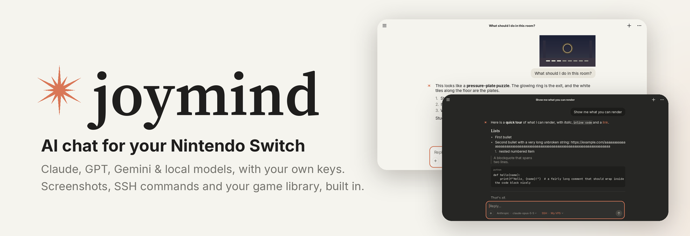
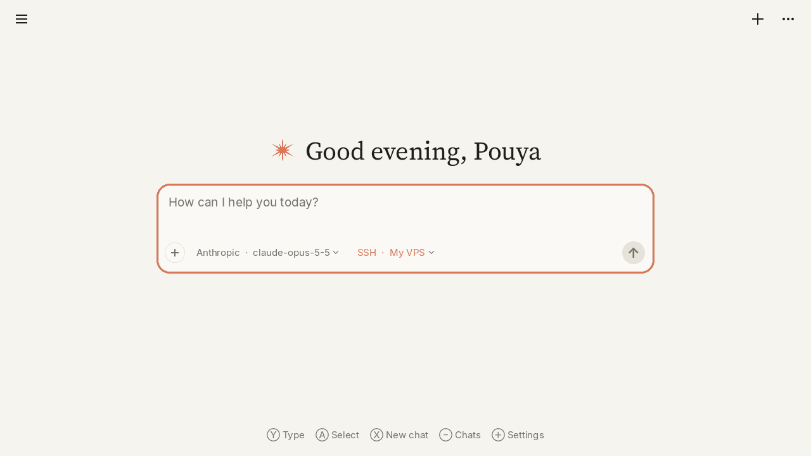
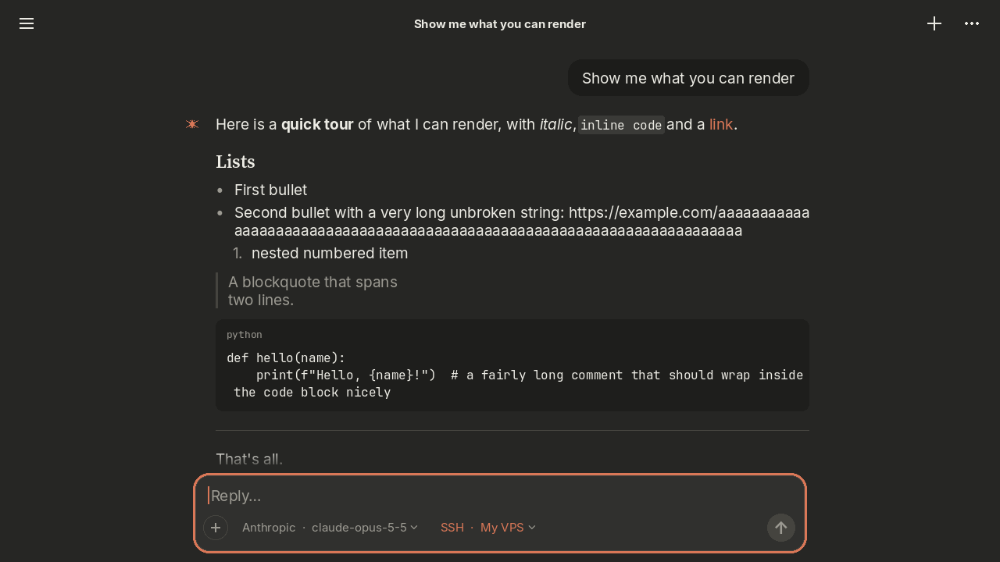
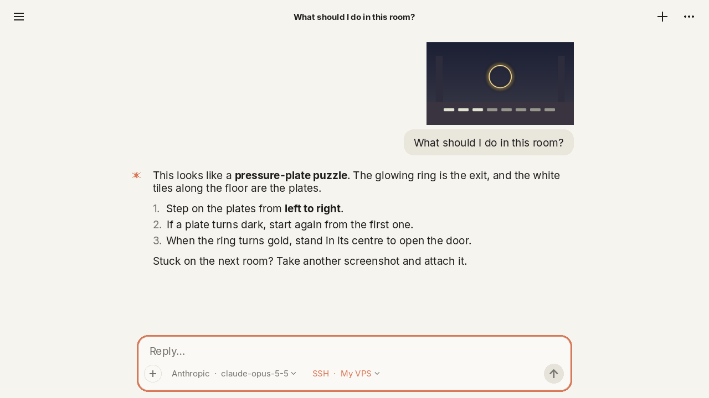
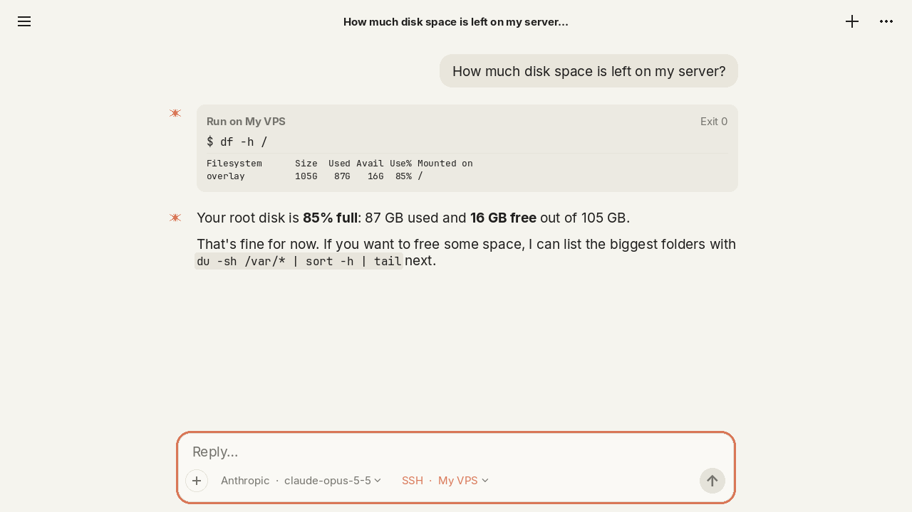
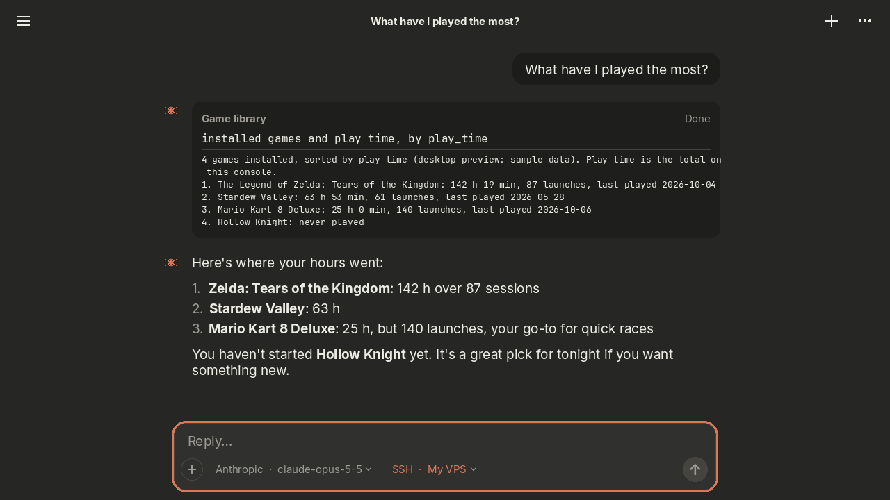
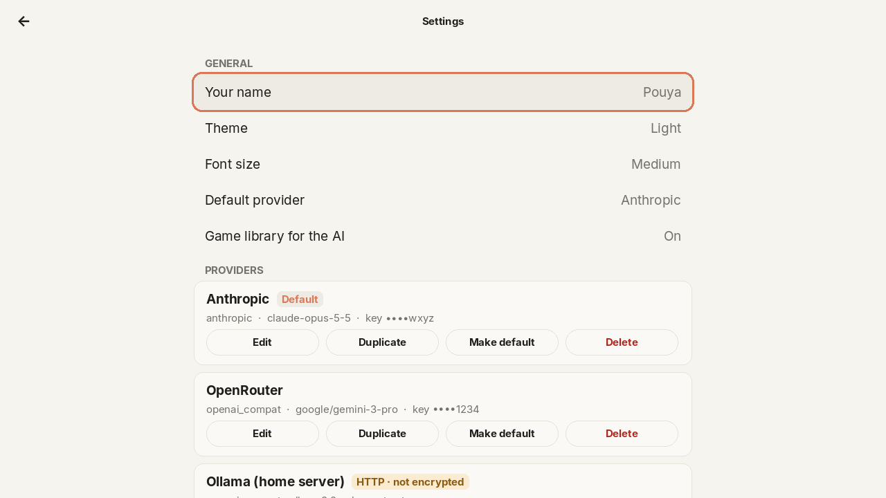

<p align="center">
  
</p>

<p align="center">
  <a href="https://github.com/P-Khodadust/joymind/actions/workflows/build.yml"></a>
  <a href="https://github.com/P-Khodadust/joymind/releases/latest"></a>
  <a href="https://github.com/P-Khodadust/joymind/releases"></a>
  
  <a href="LICENSE"></a>
</p>

<p align="center">
  <b>A native AI chat client for Nintendo Switch homebrew.</b><br>
  Claude, GPT, Gemini, OpenRouter, Groq, DeepSeek, Mistral or your own Ollama / LM Studio server,
  with your own API keys, in an app that feels like the Claude app.
</p>

---

## Highlights

- **Streaming chat** with Markdown: headings, lists, quotes, code blocks that wrap, inline code.
- **Any provider:** Anthropic, any OpenAI-compatible API, and Google Gemini. Switch provider or model mid-chat.
- **Ask about a screenshot:** press the capture button in a game, attach it, and ask "what do I do here?"
- **Let the AI run commands on your servers** over SSH, with a card for every command that you approve.
- **Knows your games:** installed games, play time and last played, for "what should I play tonight?"
- **Built for the console:** Joy-Con, touch and USB keyboard input. Sharp at 720p handheld and 1080p docked,
  light and dark themes, rumble when a long answer is ready.
- **Careful with secrets:** keys are masked, TLS is always verified, plain `http://` only on your LAN,
  and SSH host keys are pinned.

## Screenshots

| | | |
|:-:|:-:|:-:|
|  |  |  |
| **Home** | **Markdown, dark theme** | **Ask about a screenshot** |
|  |  |  |
| **SSH commands, approved by you** | **Your game library** | **Providers and machines** |

## Install

You need a Switch running custom firmware ([Atmosphère](https://github.com/Atmosphere-NX/Atmosphere))
with the Homebrew Menu.

1. Download `ai-switch.nro` from the [latest release](https://github.com/P-Khodadust/joymind/releases/latest).
2. Copy it to `sdmc:/switch/` on your SD card.
3. Start it from the Homebrew Menu. It shows up as **joymind**. For the most memory, open the
   Homebrew Menu by holding **R** while starting a game rather than from the Album.

## Quick start

1. Press **+** for Settings, then **+ Add provider**, and pick a preset (Anthropic, OpenAI, OpenRouter, Groq,
   DeepSeek, Mistral, Gemini or a custom OpenAI-compatible server).
2. Enter your **API key**, choose a **Model** (the app fetches the list), press **Test connection**, then **Save**.
3. Press **B** and start chatting: **Y** opens the keyboard, or plug in a USB keyboard and just type.

<details>
<summary><b>Or write the config on a PC</b></summary>

Settings live in `sdmc:/switch/ai-switch/config.json`:

```json
{
  "user_name": "Pouya",
  "theme": "auto",
  "default_profile": "anthropic-1",
  "profiles": [
    {
      "id": "anthropic-1", "name": "Anthropic", "type": "anthropic",
      "base_url": "https://api.anthropic.com", "api_key": "sk-ant-...",
      "model": "claude-opus-5-5", "max_tokens": 32000
    },
    {
      "id": "ollama-1", "name": "Ollama (home server)", "type": "openai_compat",
      "base_url": "http://192.168.1.100:11434/v1", "api_key": "",
      "model": "llama3.2", "max_tokens": 4096
    }
  ]
}
```

- `type` is `anthropic`, `openai_compat` or `gemini`.
- For OpenAI's newer models set `"max_tokens_field": "max_completion_tokens"` (the OpenAI preset does this).
- Newer Claude models reject `temperature`, so leave it out unless your model accepts it.
- Optional per profile: `system_prompt`, `temperature`, and `extra_headers` (an object, e.g. for OpenRouter's
  `HTTP-Referer` / `X-Title`).

Chats are saved to `sdmc:/switch/ai-switch/chats/` after every reply. A corrupt file is renamed to `*.bad`
instead of crashing the app.
</details>

## Controls

| Input | Action |
|---|---|
| D-pad / left stick | Move focus. In a chat, pushing past the edge scrolls. |
| **A** | Select. On the message box: open the keyboard. On ↑: send. On a command card: Run. |
| **B** | Back / close |
| **X** / **Y** | New chat / open the keyboard |
| **L** / **R**, right stick | Scroll |
| **+** / **−** | Settings / chat list |
| Touch | Tap anything, drag to scroll, tap the message box to type |
| USB keyboard | Type straight into the message box. Enter sends, Shift+Enter adds a line. |

## Ask about a screenshot

Press the capture button in a game, then tap **+** in the message box and pick the screenshot (up to 4 per
message). It's sent as an image to any vision model: Claude, GPT, Gemini, or a vision model on your server.

The app reads `sdmc:/Nintendo/Album/`. If your screenshots are saved to System Memory, switch
*System Settings → Data Management → Save Screenshots* to the microSD card. Deleting a chat never deletes your
screenshots.

## Let the AI run commands on your server (SSH)

1. **Settings → + Add machine.** Enter host, port, user and how to log in:
   - **Password**: works with password and keyboard-interactive logins.
   - **Key file**: use an **ECDSA** key, and copy **both** files to `sdmc:/switch/ai-switch/keys/`:
     ```sh
     ssh-keygen -t ecdsa -b 256 -f id_ecdsa       # on your PC
     ssh-copy-id -i id_ecdsa.pub user@your-server  # authorise it
     ```
     ed25519 isn't supported by the Switch's SSH library (libssh2 1.10 with mbedtls). RSA keys are refused by
     OpenSSH 8.8+ because this libssh2 signs them with SHA-1.
2. **Test connection.** On first contact you see the server's key fingerprint. Compare it with
   `ssh-keygen -lf /etc/ssh/ssh_host_ecdsa_key.pub` on the server and choose **Trust**. If the key ever
   changes, the app refuses to connect.
3. In a chat, tap the **No SSH** chip and pick the machine. Every command the AI wants to run appears as a
   card: **Run**, **Deny**, or **Always allow in this chat**.

Commands run without a terminal, with a 120 s time limit. Output is capped at 16 KB and goes back to the
AI together with the exit code. After 25 commands in a row the AI pauses until you reply.

## Your game library

When it's useful, the AI can call a read-only `get_game_library` tool that lists your installed games with
play time, launch count and last-played date. It runs on the console, needs no approval, and is only sent to
your provider when the AI asks for it. Turn it off in *Settings → Game library for the AI*.

## Security

- **API keys** are stored in `config.json` on your SD card. The app shows only the last 4 characters and
  never pre-fills them into the keyboard. Logs (`nxlink`) contain host names and status codes only.
- **HTTPS** certificates are always verified (peer, host name and date) by the console's own TLS service and
  root store. Keep the console's date correct: a wrong clock makes every certificate look invalid.
- **Plain `http://`** is allowed only for LAN and loopback addresses (10.x, 172.16–31.x, 192.168.x, 127.x,
  `localhost`) and is shown with an **HTTP** badge. Redirects are never followed.
- **SSH** host keys are pinned on first use. Each command needs your approval unless you allow a whole chat.

## Building from source

<details>
<summary><b>Install devkitPro and the packages</b></summary>

| OS | Install devkitPro | Then run |
|---|---|---|
| Windows | [devkitPro installer](https://github.com/devkitPro/installer/releases) (tick *Switch Development*), then open the *devkitPro MSys2* shell | `pacman -S switch-dev switch-sdl2 switch-sdl2_ttf switch-sdl2_image switch-freetype switch-harfbuzz switch-curl switch-libssh2 switch-zlib switch-libpng switch-bzip2` |
| Linux | [devkitpro-pacman](https://devkitpro.org/wiki/devkitPro_pacman) (on Arch: add the devkitPro repos and use `pacman`) | `sudo dkp-pacman -S switch-dev switch-sdl2 switch-sdl2_ttf switch-sdl2_image switch-freetype switch-harfbuzz switch-curl switch-libssh2 switch-zlib switch-libpng switch-bzip2` |
| macOS | [devkitpro-pacman .pkg](https://github.com/devkitPro/pacman/releases) | same as Linux |

devkitPro's `switch-curl` uses the console's own TLS service, so HTTPS doesn't need mbedtls; `switch-libssh2`
brings `switch-mbedtls` for SSH. nlohmann/json is vendored in `source/third_party`.
</details>

```sh
export DEVKITPRO=/opt/devkitpro
make -j8                       # -> ai-switch.nro
```

Or, with nothing installed but Docker or Podman:

```sh
docker run --rm -v "$PWD":/src -w /src -e DEVKITPRO=/opt/devkitpro devkitpro/devkita64 make -j8
```

For debug output over Wi-Fi, press **Y** in the Homebrew Menu and run `nxlink -s ai-switch.nro` on your PC.

The same code also builds as a desktop app for trying the UI without a Switch, and there are host tests with
a mock AI server and SSH tests. See [docs/TESTING.md](docs/TESTING.md).

## How it's built

```
source/app/            main loop, app state, the agent loop, platform layer (libnx: pad, swkbd, Album, games, rumble)
source/net/            libcurl transport + worker thread, SSE parser, SSH (libssh2), URL policy, error messages
source/net/providers/  IProvider + Anthropic, OpenAI-compatible and Gemini (requests, streaming, tools, images)
source/text/           text layout and an LRU cache of rendered text
source/markdown/       Markdown parser (incremental-friendly, open code fences render while streaming)
source/storage/        config.json and chats on the SD card
source/ui/             theme, drawing (rounded shapes, the sparkle), widgets (focus, touch, scrolling), screens
tests/                 host tests and a mock server that speaks all three provider APIs
```

Only `net/providers/` knows how each API differs. The rest of the app keeps a neutral history (text, images,
tool calls and results) and talks to `IProvider`. Everything is drawn with SDL2 and SDL_ttf: no UI toolkit.

## Credits

- [devkitPro](https://devkitpro.org) and [libnx](https://github.com/switchbrew/libnx), SDL2, SDL_ttf, SDL_image,
  FreeType, HarfBuzz, libcurl, libssh2, Mbed TLS, libjpeg-turbo, libpng, libwebp, zlib, bzip2, Mesa and
  [nlohmann/json](https://github.com/nlohmann/json). Their licenses and the full notice texts are in
  [THIRD_PARTY_NOTICES.md](THIRD_PARTY_NOTICES.md).
- Portions of this software are copyright © 2024 The FreeType Project (https://freetype.org). All rights reserved.
- This software is based in part on the work of the Independent JPEG Group.
- Fonts: [Inter](https://rsms.me/inter/), [Source Serif 4](https://github.com/adobe-fonts/source-serif) and
  [JetBrains Mono](https://www.jetbrains.com/lp/mono/), all under the SIL Open Font License (texts in
  `romfs/fonts/`).

## License

[MIT](LICENSE) for the code. The release binary also contains third-party libraries under their own permissive
licenses (zlib, MIT, BSD, ISC, FTL, IJG, Apache-2.0); see [THIRD_PARTY_NOTICES.md](THIRD_PARTY_NOTICES.md).
Fonts are under the SIL Open Font License 1.1.

joymind is an unofficial project. It is not affiliated with or endorsed by Anthropic, Nintendo, OpenAI or
Google. Claude is a trademark of Anthropic; Nintendo Switch is a trademark of Nintendo. The sparkle icon is
original and drawn in code.
